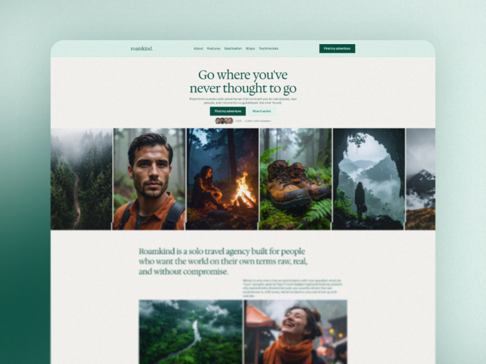

# Roamkind

> Full brand identity, copy, image direction, and Framer website - built from scratch.
> Solo travel agency for people who want the world on their own terms. No tourist traps. Ever.

---

## Live Site

🧭 [Roamkind live site](https://roamkind.framer.website/)

---

## Links

[Upwork Project](https://www.upwork.com/freelancers/~014b89a959de140af2?p=2068340152633688064)

[Upwork Profile](https://www.upwork.com/freelancers/~014b89a959de140af2?mp_source=share)

[Full Case Study](./CASE-STUDY.md)

---

## Brand System

| Role | Token | Hex | Opacity |
|------|-------|-----|---------|
| Background | Background | `#FAF9F6` | 100% |
| Primary | Ascent + Text | `#085041` | 100% |
| Body | Body Text | `#085041` | 80% |
| Border | Border | `#084F40` | 10% |
| Special | Special | `#E1F5EE` | 100% |

**Typography:**

| Role | Font | Size | Weight |
|------|------|------|--------|
| H1 | `Hedvig Letters Serif` | 61px / 1.1 | Regular |
| H2 | `Hedvig Letters Serif` | 49px / 1.2 | Regular |
| H3 | `Hedvig Letters Serif` | 39px / 1.3 | Regular |
| H4 | `Hedvig Letters Serif` | 31px / 1.4 | Regular |
| H5 | `Hedvig Letters Serif` | 25px / 1.3 | Regular |
| H6 | `Hedvig Letters Serif` | 20px / 1.4 | Regular |
| Body | `General Sans` | 16px / 1.2 | Medium |
| Button | `General Sans` | 16px / 1.2 | Medium |
| Small | `General Sans` | 13px / 1.4 | Medium |

---

## What Was Built

```
Desktop
├── Navigation
├── Main
│   ├── Hero Section
│   └── Body Container
│       ├── About Section
│       ├── Features Section
│       ├── Destination Section
│       ├── Steps Section
│       └── Testimonials Section
└── Footer
Tablet
Phone
```

---

## Built With

- Framer
- Hedvig Letters Serif - Google Fonts
- General Sans - Google Fonts
- Firefly (image direction)

---


*Designed & built by Himanshu Dhara - Framer Developer & Brand Designer - 2026*
